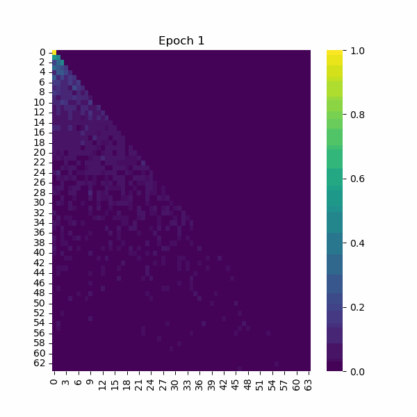
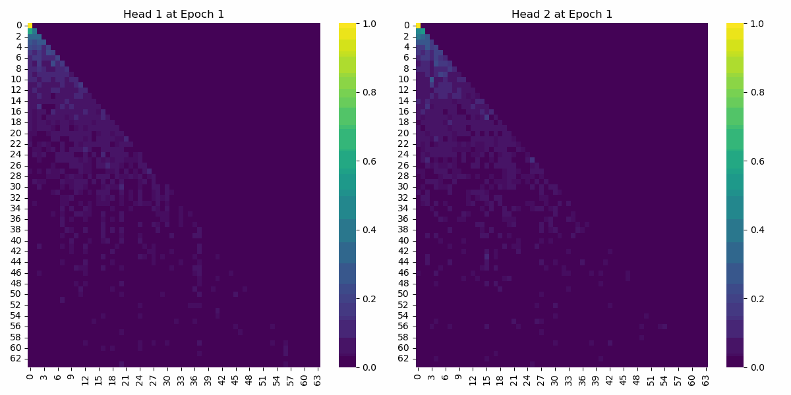
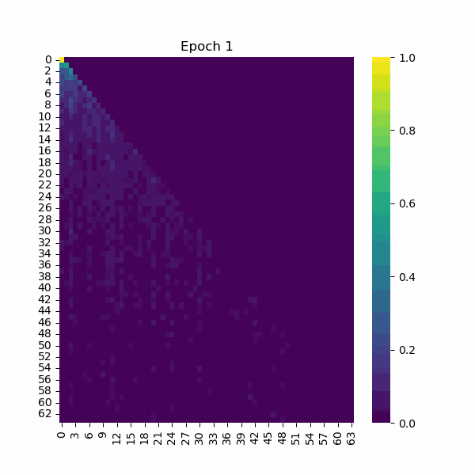
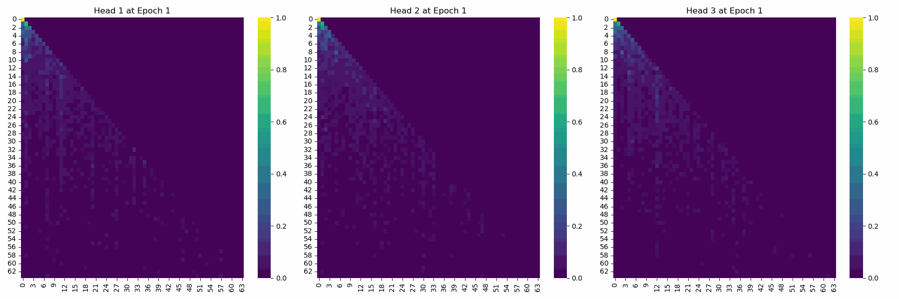
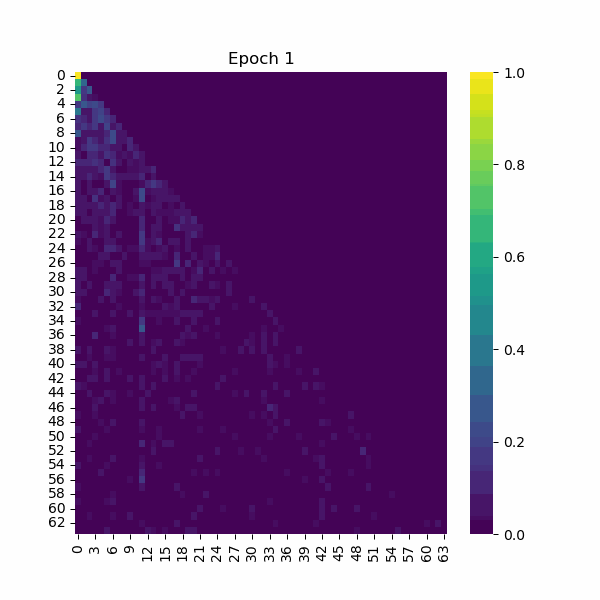

# ICL
We are interested in understanding how transformers develop the in-context-learning ability through gradient descent. This repo reproduces implemetations of a few ICL experiments. Our implemetation is more efficient compared to some of the original implementations (see the [notebook](./Test.ipynb) for more details). For demostrations of how to run the experiments, see the [notebook](./markov_attn.ipynb). 

### 📖 Citations

```bibtex
@article{bietti2024birth,
  title={Birth of a transformer: A memory viewpoint},
  author={Bietti, Alberto and Cabannes, Vivien and Bouchacourt, Diane and Jegou, Herve and Bottou, Leon},
  journal={Advances in Neural Information Processing Systems},
  volume={36},
  year={2024}
}
```
```bibtex
@article{guo2024active,
  title={Active-dormant attention heads: Mechanistically demystifying extreme-token phenomena in llms},
  author={Guo, Tianyu and Pai, Druv and Bai, Yu and Jiao, Jiantao and Jordan, Michael I and Mei, Song},
  journal={arXiv preprint arXiv:2410.13835},
  year={2024}
}
```

```bibtex
@article{nichani2024transformers,
  title={How transformers learn causal structure with gradient descent},
  author={Nichani, Eshaan and Damian, Alex and Lee, Jason D},
  journal={arXiv preprint arXiv:2402.14735},
  year={2024}
}
```

```bibtex
@article{rajaraman2024transformers,
  title={Transformers on markov data: Constant depth suffices},
  author={Rajaraman, Nived and Bondaschi, Marco and Ramchandran, Kannan and Gastpar, Michael and Makkuva, Ashok Vardhan},
  journal={arXiv preprint arXiv:2407.17686},
  year={2024}
}
```
#### Order-2 Markov Chain
##### First Layer



##### Second Layer



#### Order-3 Markov Chain
##### First Layer



##### Second Layer

