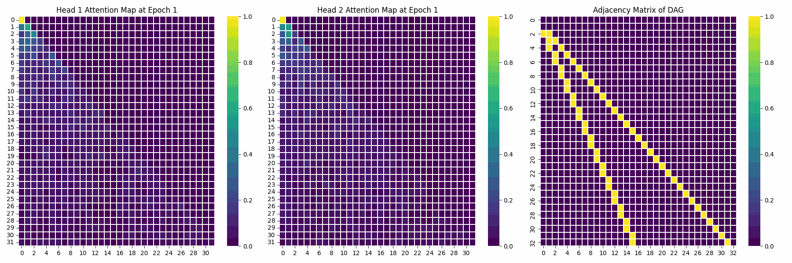

# ICL
Implemetation of a few ICL experiments.

### 📖 Citations

```bibtex
@article{bietti2024birth,
  title={Birth of a transformer: A memory viewpoint},
  author={Bietti, Alberto and Cabannes, Vivien and Bouchacourt, Diane and Jegou, Herve and Bottou, Leon},
  journal={Advances in Neural Information Processing Systems},
  volume={36},
  year={2024}
}
```
```bibtex
@article{guo2024active,
  title={Active-dormant attention heads: Mechanistically demystifying extreme-token phenomena in llms},
  author={Guo, Tianyu and Pai, Druv and Bai, Yu and Jiao, Jiantao and Jordan, Michael I and Mei, Song},
  journal={arXiv preprint arXiv:2410.13835},
  year={2024}
}
```
```bibtex
@article{nichani2024transformers,
  title={How transformers learn causal structure with gradient descent},
  author={Nichani, Eshaan and Damian, Alex and Lee, Jason D},
  journal={arXiv preprint arXiv:2402.14735},
  year={2024}
}
```

